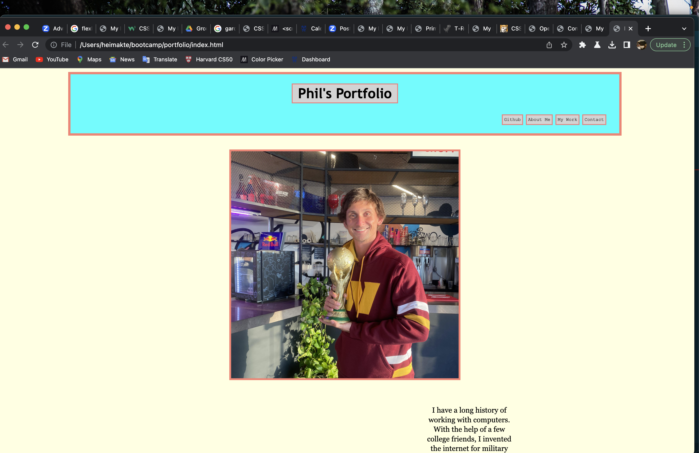

# <Portfolio>

## Description

This webpage showcases my illustrious career as a web developer. Additionally, it serves as a useful excercises in HTML and CSS coding. As always, we get good practice with the git workflow as well.

## Installation

Installation for this webpage is not necessary, the deployed website can be viewed at: https://moviefan322.github.io/Portfolio/

## Usage

Simply naviate to the following URL to learn all about my amazing career and how I invented the internet: https://moviefan322.github.io/Portfolio/

## Credits

All code was written by me, I had to reference a few snippets for functionality, but not enough to merit a credit reference.

## License

MIT Licence
